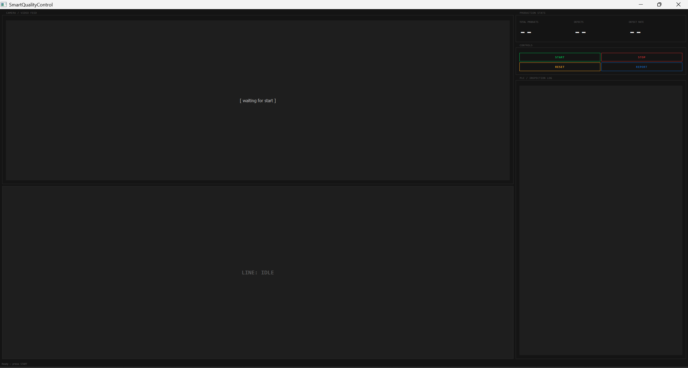
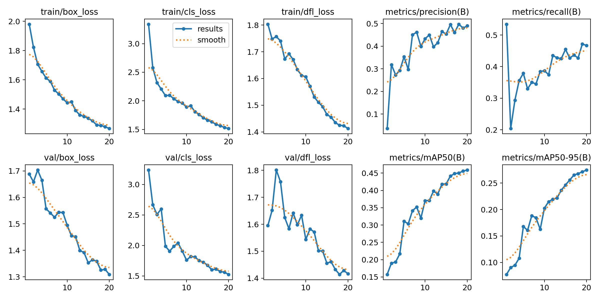
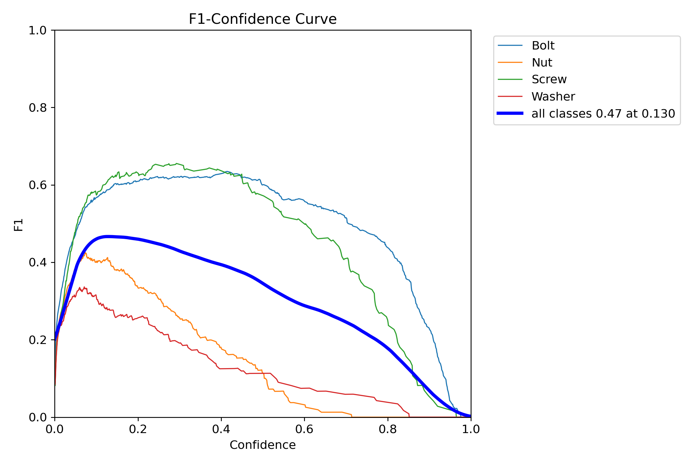
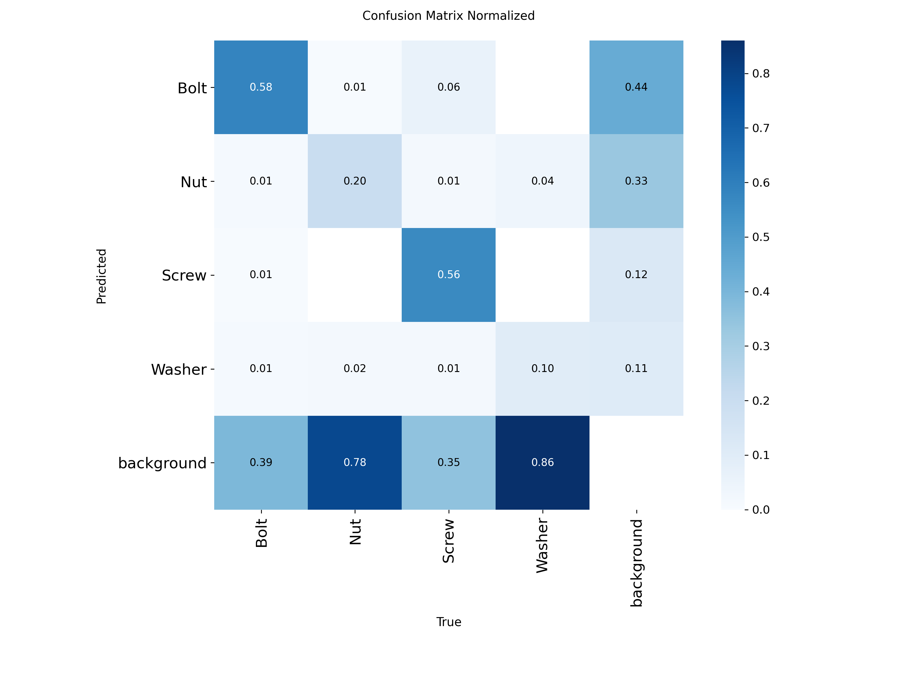

# FactoryEye


Real-time industrial quality control system built around a **Beckhoff TwinCAT 3 PLC**. A Python process feeds detection events over the ADS protocol; the PLC executes the control algorithm and drives physical outputs — belt motor, reject cylinder, indicator lights, and alarm buzzer.

---

## Dashboard



---

## System Architecture

```
[Camera / Video File]
        │
        ▼
[YOLOv8 Inference + Defect Logic]   (python/vision.py)
        │
        │  write_by_name() over ADS
        ▼
┌─────────────────────────────────────────────────────┐
│              GVL_PythonBridge (TwinCAT GVL)         │
│                                                     │
│  Python → PLC        │  PLC → Python               │
│  ─────────────────   │  ─────────────────          │
│  Start_Button        │  Line_Running               │
│  Product_Sensor      │  Total_Count                │
│  Product_Defective   │  Defect_Count               │
│  Stop_Line           │                             │
│  Defect_Rate         │                             │
└─────────────────────────────────────────────────────┘
        │
        │  PLC scan cycle (IEC 61131-3 Structured Text)
        ▼
[TwinCAT 3 — MAIN.TcPOU]
  Belt Motor Interlock
  TON Inspection Timer
  Reject Cylinder Logic
  R_TRIG + CTU Counters
  Auto-Stop & Reset Latch
        │
        ▼
[Physical Outputs]
  Belt Motor  |  Reject Cylinder  |  Green/Red Light  |  Alarm Buzzer
        │
        ▼
[Gemini LLM Agent]  →  slow_belt / stop_line / maintenance_check
        │
        ▼
[PyQt5 Dashboard]  +  [PDF Shift Report]
```

---

## PLC Control Algorithm

The control program runs in TwinCAT 3 (`MAIN.TcPOU`, IEC 61131-3 Structured Text). Every scan cycle the PLC reads `GVL_PythonBridge`, executes the logic below, and updates its outputs.

### 1 — Belt Motor Interlock

```iecst
IF (GVL_PythonBridge.Start_Button OR GVL_PythonBridge.Belt_Motor)
   AND NOT GVL_PythonBridge.Emergency_Stop
   AND NOT GVL_PythonBridge.Stop_Line THEN
    GVL_PythonBridge.Belt_Motor   := TRUE;
    GVL_PythonBridge.Line_Running := TRUE;
ELSE
    GVL_PythonBridge.Belt_Motor   := FALSE;
    GVL_PythonBridge.Line_Running := FALSE;
END_IF;
```

`Belt_Motor` latches itself ON after the first `Start_Button` pulse — the button does not need to be held. The interlock priority is **Emergency_Stop > Stop_Line > Start**, which matches standard industrial safety practice.

### 2 — Inspection Timer & Reject Cylinder

```iecst
Timer_Inspection(
    IN := GVL_PythonBridge.Product_Sensor AND GVL_PythonBridge.Belt_Motor,
    PT := T#2S
);

GVL_PythonBridge.Reject_Cylinder :=
    Timer_Inspection.Q AND GVL_PythonBridge.Product_Defective;
```

A `TON` (on-delay timer) starts the moment a part is detected on the belt. The reject cylinder fires only when **both** conditions are met: the 2-second window has elapsed **and** Python has written `Product_Defective = TRUE`. The timer duration is intentionally matched to `INSPECTION_DELAY` in `config.py` — this is how the PLC and the Python vision pipeline are synchronized without any additional handshake.

### 3 — Rising-Edge Counters

```iecst
Product_Sensor_Rise(CLK := GVL_PythonBridge.Product_Sensor);
Counter_Total.CU := Product_Sensor_Rise.Q;
Counter_Total();
GVL_PythonBridge.Total_Count := Counter_Total.CV;

Defect_Rise(CLK := GVL_PythonBridge.Product_Defective);
Counter_Defect.CU := Defect_Rise.Q;
Counter_Defect();
GVL_PythonBridge.Defect_Count := Counter_Defect.CV;
```

`R_TRIG` blocks convert the level signals from Python into single-scan pulses. Without rising-edge detection, a part that stays in the sensor field across multiple scan cycles would be counted many times. Both `CTU` counter values are read back by Python over ADS and shown on the dashboard.

### 4 — Auto-Stop & Manual Reset Latch

```iecst
IF GVL_PythonBridge.Defect_Rate >= 10.0 THEN
    GVL_PythonBridge.Stop_Line := TRUE;
END_IF;

IF GVL_PythonBridge.Start_Button AND GVL_PythonBridge.Stop_Line THEN
    GVL_PythonBridge.Stop_Line := FALSE;
END_IF;
```

When `Defect_Rate` (a REAL written by Python) reaches the threshold, the PLC stops the line **on its own** — this decision is made in the scan cycle, independent of any Python logic. The stop is latched: the line will not restart automatically. The operator must press Start again to clear the latch, which is a deliberate safety requirement.

### Output Map

| Output | Active when |
|---|---|
| `Belt_Motor` | Line running — no emergency, no stop |
| `Reject_Cylinder` | Inspection timer elapsed AND part flagged defective |
| `Green_Light` | Belt motor ON |
| `Red_Light` | Stop_Line active |
| `Alarm_Buzzer` | Stop_Line active |

---

## Python ↔ PLC Communication (ADS)

TwinCAT exposes its runtime over the **ADS (Automation Device Specification)** protocol, a Beckhoff-proprietary transport layer built on top of TCP/IP. Python connects via `pyads` and accesses PLC variables by their symbolic name — no memory-mapped addresses, no OPC-UA server needed.

```python
# plc.py — establishing the connection
self.plc = pyads.Connection(AMS_NET_ID, ADS_PORT)   # '127.0.0.1.1.1', port 851
self.plc.open()

# Writing a signal to the PLC
self.plc.write_by_name('GVL_PythonBridge.Product_Defective', True, pyads.PLCTYPE_BOOL)

# Reading a counter value back from the PLC
total = self.plc.read_by_name('GVL_PythonBridge.Total_Count', pyads.PLCTYPE_INT)
```

All shared variables live in `GVL_PythonBridge` — a TwinCAT Global Variable List that acts as the shared memory between the ST program and the Python process:

| Variable | Type | Direction | Purpose |
|---|---|---|---|
| `Start_Button` | BOOL | Python → PLC | Pulse to start the line |
| `Emergency_Stop` | BOOL | Python → PLC | Hard stop, highest priority |
| `Product_Sensor` | BOOL | Python → PLC | Part detected in frame |
| `Product_Defective` | BOOL | Python → PLC | Vision system defect flag |
| `Stop_Line` | BOOL | Python → PLC | Soft stop command |
| `Defect_Rate` | REAL | Python → PLC | Current defect % (drives auto-stop) |
| `Line_Running` | BOOL | PLC → Python | Confirmed running state |
| `Total_Count` | INT | PLC → Python | Products counted by PLC |
| `Defect_Count` | INT | PLC → Python | Defects counted by PLC |

### Inspection Cycle — Signal Flow

```
Python                          PLC (scan cycle)
──────                          ────────────────
vision.inspect()
  └─ YOLO inference (≤2s)

write Product_Sensor = TRUE  →  R_TRIG fires → Counter_Total increments
                                TON timer starts (PT=2s)

write Product_Defective = X  →  (X stored in GVL, timer still running)

                                Timer.Q = TRUE (2s elapsed)
                                Reject_Cylinder = Timer.Q AND Product_Defective

write Defect_Rate = rate     →  IF rate >= 10.0 → Stop_Line := TRUE
                                Belt_Motor = FALSE, Line_Running = FALSE

read Line_Running            ←  FALSE
read Total_Count             ←  updated counter value
read Defect_Count            ←  updated counter value
```

### Mock Mode

`mock_plc.py` implements the same interface as `plc.py` in pure Python — no TwinCAT runtime required. The mock correctly simulates the latching, counter, and stop logic so the full pipeline (dashboard, agent, reporting) can be tested end-to-end without any hardware.

---

## Quick Start

### 1. Install dependencies

```bash
pip install -r requirements.txt
```

### 2. Get a detection model

```bash
# Option A — train on the Roboflow Bolts dataset (free API key at roboflow.com)
python python/setup_model.py --api-key YOUR_KEY

# Option B — COCO yolov8n with size-based defect detection (no key required)
python python/setup_model.py --fallback
```

### 3. Run the dashboard (mock mode — no TwinCAT needed)

```bash
python python/dashboard.py
```

### 4. Run the CLI loop

```bash
python python/main.py --mock --defect-prob 0.15
```

---

## TwinCAT Integration

> Requires Beckhoff TwinCAT 3 Runtime and an XAR license.

1. Open `twincat/SmartQualityControl.sln` in TwinCAT XAE
2. Activate configuration and set runtime to **Run** mode
3. Run without the `--mock` flag:

```bash
python python/dashboard.py
```

---

## LLM Agent (optional)

Create a `.env` file in the project root:

```
GEMINI_API_KEY=your_key_here
```

Gemini 2.0 Flash activates when the defect rate exceeds `AGENT_TRIGGER_RATE` (default 8%) and returns structured JSON:

```json
{
  "severity": "warning",
  "recommendation": "Reduce belt speed to allow more inspection time.",
  "action": "slow_belt"
}
```

The agent disables itself silently if no API key is set.

---

## Tech Stack

| Layer | Technology |
|---|---|
| PLC | Beckhoff TwinCAT 3, Structured Text (IEC 61131-3) |
| PLC ↔ Python | pyads (ADS protocol) |
| Vision | YOLOv8n (Ultralytics), OpenCV |
| LLM Agent | Google Gemini 2.0 Flash (google-genai SDK) |
| Dashboard | PyQt5 |
| Reporting | fpdf2 |

---

## Vision Model

YOLOv8n trained for 20 epochs on the [Bolts Final v1](https://universe.roboflow.com/bolts/bolts-final) dataset (645 images, 4 classes: Bolt, Nut, Screw, Washer). Model accuracy is intentionally secondary — it exists to generate detection events that drive the PLC logic. Swapping in a better model is a one-line change in `config.py`.

| mAP50 | Confidence threshold | Classes |
|---|---|---|
| 0.46 | 0.12 | Bolt, Nut, Screw, Washer |



| F1 Curve | Confusion Matrix |
|---|---|
|  |  |

---

## Configuration

All tunable parameters are in `python/config.py`:

```python
VISION_SOURCE      = 'test_videos/bolt-multi-size-detection.mp4'  # 0 for webcam
YOLO_MODEL         = 'models/bolt_detector.pt'
CONFIDENCE         = 0.12
DEFECT_SIZE_MIN    = 0.005   # bbox/frame area — undersized
DEFECT_SIZE_MAX    = 0.030   # bbox/frame area — oversized
DEFECT_THRESHOLD   = 10.0    # % defect rate → auto stop line
INSPECTION_DELAY   = 2.0     # seconds between inspection cycles (must match PLC TON)
AGENT_TRIGGER_RATE = 8.0     # % rate at which LLM agent activates
```

---

## Project Structure

```
FactoryEye/
├── python/
│   ├── dashboard.py       # PyQt5 HMI — main entry point
│   ├── main.py            # CLI production loop
│   ├── plc.py             # TwinCAT ADS bridge
│   ├── mock_plc.py        # Simulated PLC (no hardware needed)
│   ├── vision.py          # YOLOv8 inference + defect logic
│   ├── agent.py           # Gemini LLM advisory agent
│   ├── report.py          # PDF shift report generator
│   ├── setup_model.py     # Model download / training helper
│   └── config.py          # All configuration constants
├── twincat/
│   └── SmartQualityControl_PLC/
│       ├── POUs/MAIN.TcPOU          # Control algorithm (ST)
│       └── GVLs/GVL_PythonBridge.TcGVL
├── docs/
├── models/
├── test_videos/
├── requirements.txt
└── .env.example
```

---

## Credits

- Test videos sourced from [Intel IoT DevKit — Sample Videos](https://github.com/intel-iot-devkit/sample-videos)
- Detection dataset: [Bolts Final v1](https://universe.roboflow.com/bolts/bolts-final) on Roboflow Universe

---

## License

MIT
